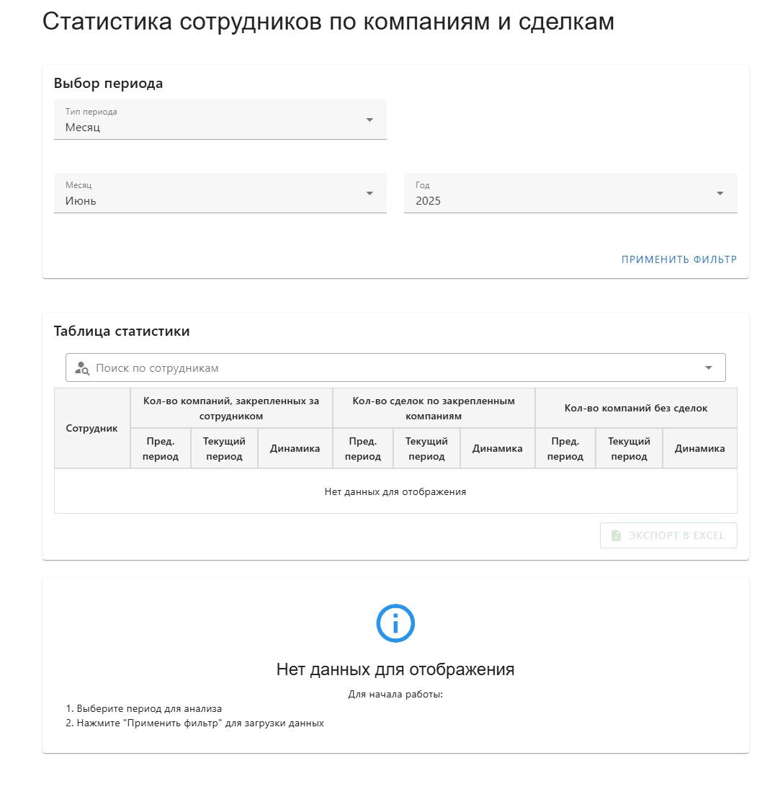

# Статистика сотрудников Bitrix24

Простое веб-приложение для отслеживания эффективности работы сотрудников в Bitrix24.

## Что умеет приложение?

- 📊 **Показывает статистику по каждому сотруднику:**
  - Количество закрепленных компаний
  - Количество сделок
  - Количество компаний без сделок

- 📈 **Сравнивает с прошлым периодом:**
  - Наглядно показывает рост или падение показателей
  - Автоматически рассчитывает предыдущий период для сравнения

- 📅 **Гибкий выбор периода:**
  - Выбирайте любой интересующий вас временной промежуток
  - Анализируйте данные за день, неделю, месяц или произвольный период

- 📱 **Адаптивный дизайн:**
  - Удобно пользоваться как на компьютере, так и на мобильных устройствах

  

## Для кого это приложение?

- 👨‍💼 **Руководителей отделов продаж**
- 👩‍💼 **HR-специалистов**
- 📋 **Менеджеров проектов**
- 🧑‍💻 **Всех, кто работает с Bitrix24 и хочет отслеживать эффективность команды**

## Технические детали

Приложение разработано с использованием современных веб-технологий:
- Vue.js 3
- Vuetify
- Chart.js
- Pinia

Приложение не хранит ваши данные — вся информация загружается напрямую из вашего Bitrix24. 